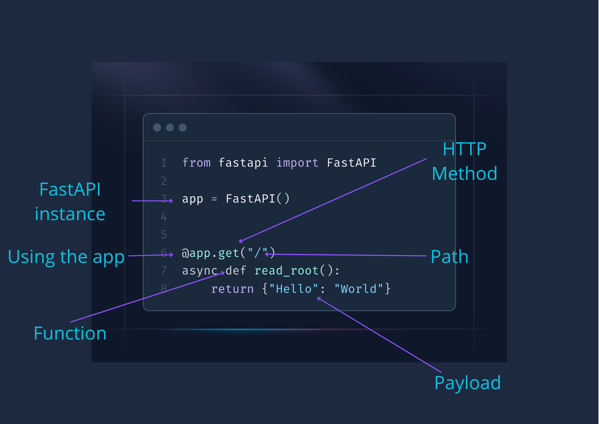

# FastAPI Learning Repository

## Setup and Installation

1. Create a virtual environment using `uv`:

```bash
uv venv
source .venv/bin/activate  # On Unix/macOS
# or
.venv\Scripts\activate  # On Windows
```

2. Install required dependencies:

```bash
# uv pip install 'fastapi[all]'
uv add 'fastapi[all]'
```

Both commands work, but `uv add` is the preferred way as it's faster and handles dependencies more efficiently than `uv pip install`.

## Basic FastAPI Application

Here's our first FastAPI application (`main.py`):



Let's break down each part:

- `from fastapi import FastAPI`: Imports the FastAPI class
- `app = FastAPI()`: Creates an instance of the FastAPI application
- `@app.get("/")`: Decorator that tells FastAPI this function handles GET requests at the root path "/"
- `async def root()`: Defines an asynchronous function that handles the request
- `return {"message": "Hello World"}`: Returns a JSON response

To run the application:

```bash
uvicorn main:app --reload
```

The `--reload` flag enables auto-reload during development when code changes are detected.

## HTTP Methods

HTTP methods (also called HTTP verbs) define the type of action you want to perform on a resource. Here are the most common ones used in web APIs:

### GET

- **Purpose**: Retrieve data from the server
- **Characteristics**: Safe and idempotent (can be called multiple times without side effects)
- **Example**: Getting a list of users or fetching a specific user's details
- **FastAPI**: `@app.get("/users")`

### POST

- **Purpose**: Create new resources on the server
- **Characteristics**: Not idempotent (calling it multiple times may create multiple resources)
- **Example**: Creating a new user account or submitting a form
- **FastAPI**: `@app.post("/users")`

### PUT

- **Purpose**: Update or replace an entire resource
- **Characteristics**: Idempotent (calling it multiple times has the same effect)
- **Example**: Updating all fields of a user profile
- **FastAPI**: `@app.put("/users/{user_id}")`

### PATCH

- **Purpose**: Partially update a resource
- **Characteristics**: Not necessarily idempotent
- **Example**: Updating only the email field of a user
- **FastAPI**: `@app.patch("/users/{user_id}")`

### DELETE

- **Purpose**: Remove a resource from the server
- **Characteristics**: Idempotent (deleting the same resource multiple times has the same effect)
- **Example**: Deleting a user account or removing a post
- **FastAPI**: `@app.delete("/users/{user_id}")`

### Quick Reference

```python
@app.get("/posts")          # Get all posts
@app.get("/posts/{id}")     # Get specific post
@app.post("/posts")         # Create new post
@app.put("/posts/{id}")     # Update entire post
@app.patch("/posts/{id}")   # Partially update post
@app.delete("/posts/{id}")  # Delete post
```

## Pydantic Models for Data Validation

FastAPI uses **Pydantic models** to automatically validate request data and generate API documentation. Here's an example:

```python
from pydantic import BaseModel

class Post(BaseModel):
    title: str                    # Required string field
    content: str                  # Required string field
    published: bool = True        # Optional boolean with default True
    tags: list[str] | None = []   # Optional list of strings, defaults to empty list
```

### How it works:

- **Automatic validation**: FastAPI validates incoming JSON against the model
- **Type conversion**: Converts JSON data to Python objects
- **Error handling**: Returns detailed error messages for invalid data
- **Documentation**: Automatically generates API docs showing the expected schema

### Usage in endpoints:

```python
@app.post("/posts")
async def create_post(post: Post):
    return {"msg": "post created", "data": post}
```

When you send a POST request with JSON data, FastAPI automatically validates it against the `Post` model and provides a Python object with all the validated data.
